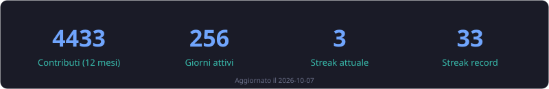

---

## 👨‍💻 Chi sono

Sviluppatore **full-stack** con una passione ossessiva per le infrastrutture **self-hosted** e i sistemi che funzionano davvero. Progetto e costruisco applicazioni web, API backend e app mobile: dall'ideazione al deploy, senza lasciare nulla al caso.

Amo mettere le mani su sistemi **reali, in produzione**, e farli evolversi nel tempo: più veloci, più sicuri, più facili da mantenere. Perché il codice scritto oggi deve sopravvivere al domani. 🛠️

---

## ⚡ Cosa faccio

| | |
|---|---|
| 🧠 **Backend & API** | Servizi solidi, autenticazione e gestione degli accessi, integrazioni e sincronizzazione dei dati |
| 🎨 **Frontend** | Interfacce moderne e responsive, portali e gestionali aziendali |
| 📱 **Mobile** | App multipiattaforma con notifiche push |
| 🏛️ **Siti istituzionali** | Realizzazione e manutenzione per enti pubblici e aziende, in ambienti containerizzati |
| 🔌 **Integrazione** | Collegamento tra ERP, gestionali e database di natura diversa |
| 🛡️ **Sicurezza** | Piattaforme di cybersecurity, privacy e accesso sicuro ai servizi |
| 🏠 **Infrastruttura** | Ambienti containerizzati, server self-hosted, monitoraggio |
| 🤖 **Automazione** | Script e strumenti che eliminano il lavoro ripetitivo |

---

## 🧭 Il mio modo di lavorare

- 🔄 **Refactoring progressivo:** si migliora un sistema senza rompere ciò che funziona, step by step
- ✅ **Qualità non negoziabile:** test automatici, CI/CD robusti e analisi statica ogni giorno
- 📚 **Documentazione viva:** la scrivo mentre sviluppo, non è un'aggiunta dopo
- 🚀 **Strumenti che accelerano:** automation, IA e script custom per stare sempre un passo avanti
- 🔍 **Curiosità prima di tutto:** sempre a caccia di come funzionano le cose, cosa si può migliorare

---

## 📊 GitHub in numeri

---

## 📫 Collaboriamo

Se hai un'idea, un progetto che ha bisogno di scaling, o semplicemente vuoi farmi una domanda tecnica, sono tutto orecchi.

*L'idea giusta al momento giusto può cambiare tutto.* ✨

